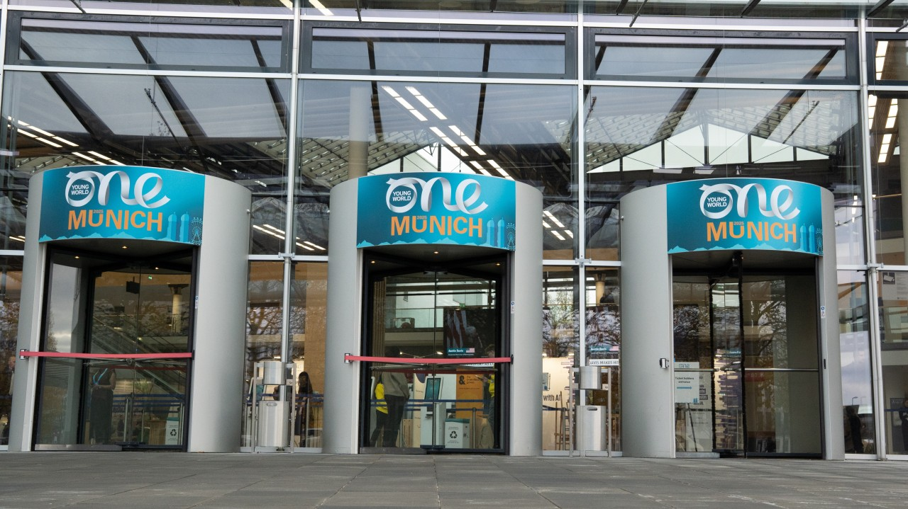
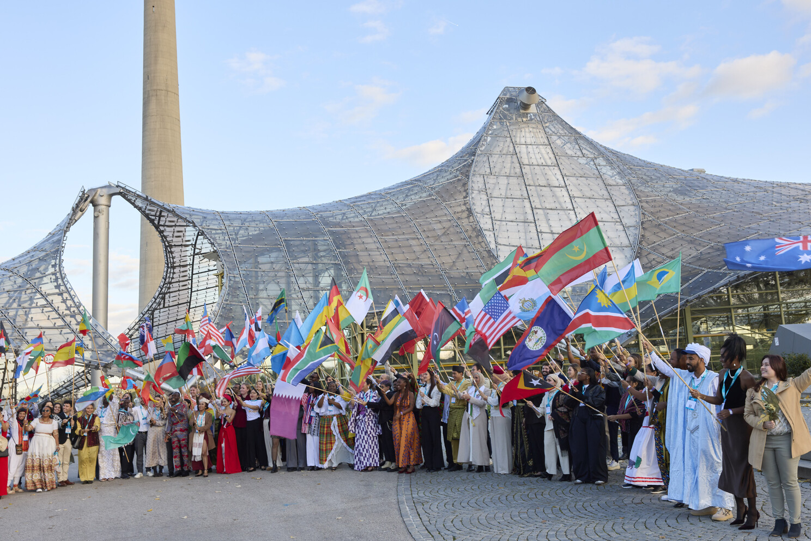
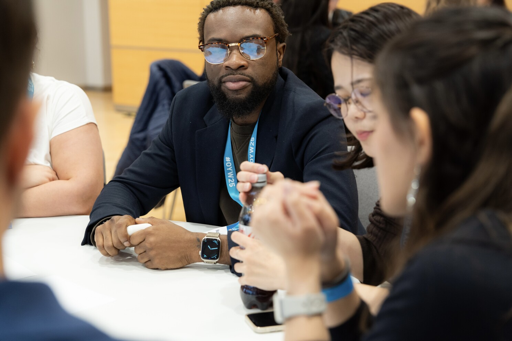
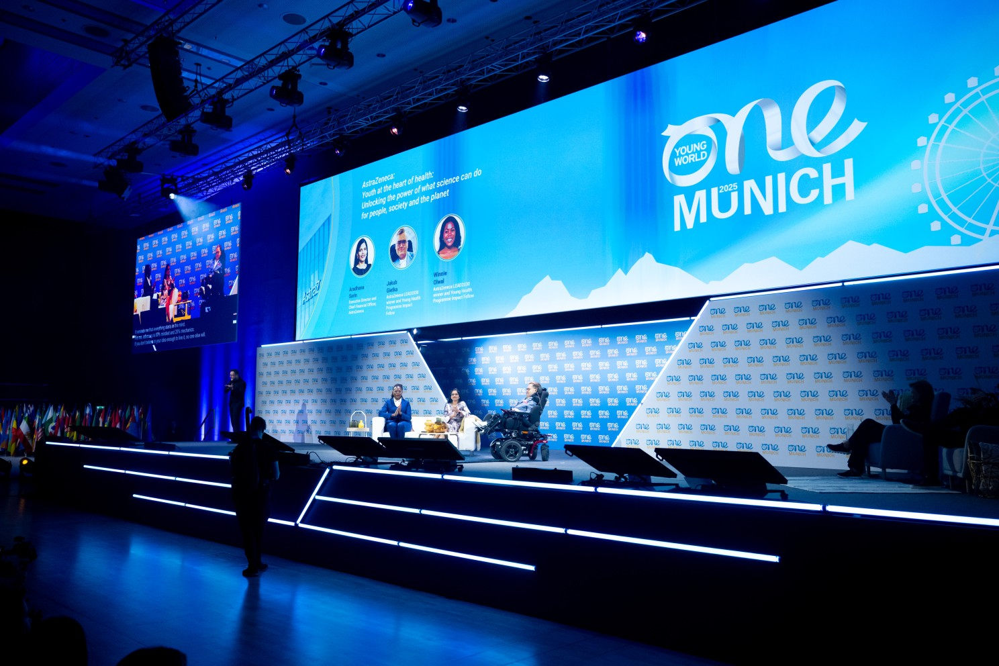
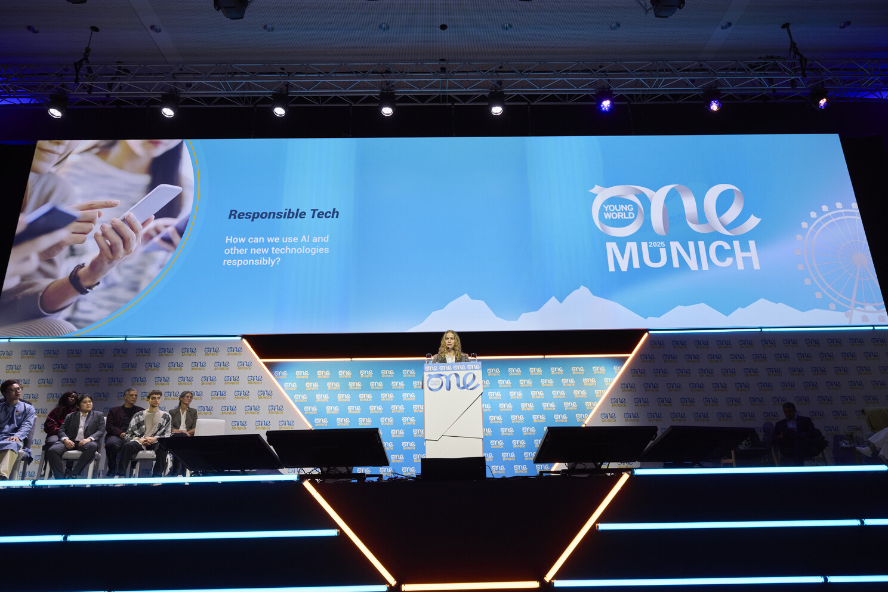
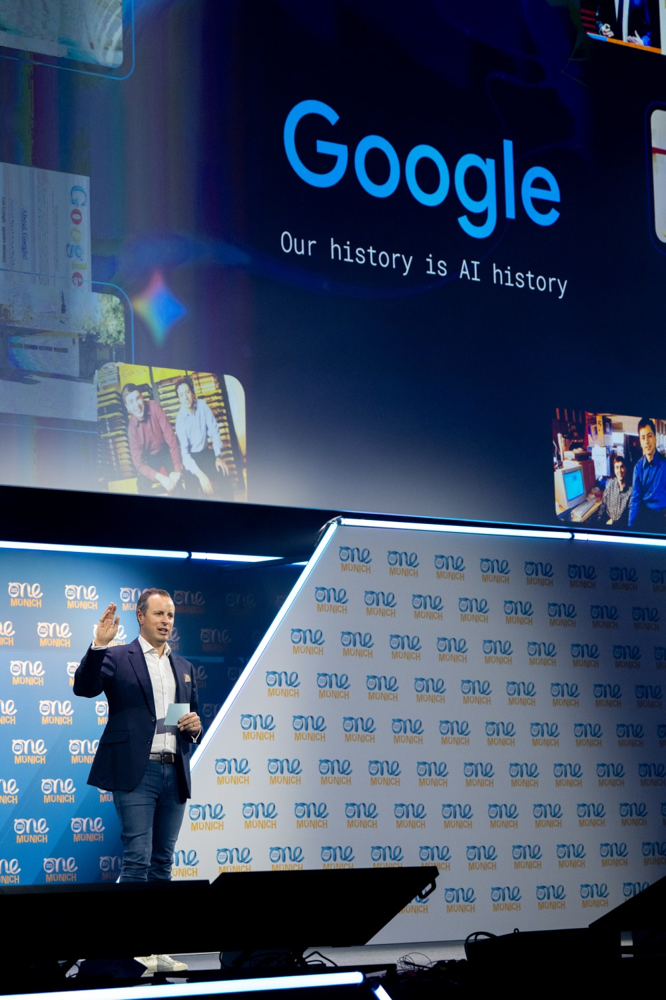
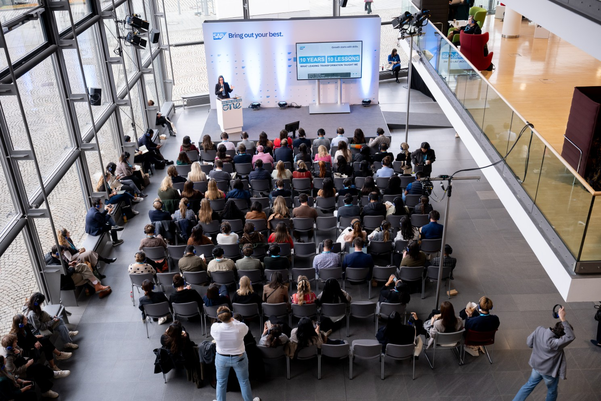

# Reflections from the One Young World Summit Munich 2025

Attending the One Young World Summit in Munich as a delegate representing the NHS, supported by Roche was far more than a professional milestone. It was a brilliant moment of alignment where global conversations about mental health, health equity, and responsible innovation/tech met the realities of my daily work in the UK healthcare sector.

Across four days, the summit became a classroom. Thousands of young leaders, scientists, policymakers, entrepreneurs and activists gathered under one roof, everyone carrying their own story and their own purpose. What united us was the belief that the systems shaping our world must be re-designed for fairness, dignity and shared prosperity.

## Mental Health as a Global Priority

A recurring thread across sessions was the recognition that mental health is no longer a hidden issue — it is a global priority. In the Mental Health & Wellbeing Action Circle, delegates spoke openly about trauma, inequality, stigma and the structural barriers preventing people from accessing timely and culturally competent support.

One contribution captured it clearly:

> “Mental health is not a clinical issue alone. It’s shaped by policy, environment, identity, technology and opportunity.”

These discussions reaffirmed something I witness in the NHS every day: mental health indicators often point to deeper social fractures. The data behind crises and emergency responses reflect environments and not just individual failings. Listening to global voices expanded my thinking on how data can be used responsibly to identify inequalities, address systemic gaps, and design better pathways.

## Health Equity and Youth Leadership

Health equity emerged as a defining theme. Sessions led by AstraZeneca’s Young Health Programme highlighted youth-led interventions addressing social determinants of health across different demographics — from health literacy and prevention to community support models.

One speaker summarised it powerfully:

> “Young leaders don’t just bring energy. We bring insight into the lived realities of today’s world.”

Representing the NHS in this environment made me reflect on our own systems. How can we amplify youth leadership within UK health innovation? How can we make our analytics more participatory, intersectional, and community-informed? These conversations strengthened my commitment to using mental-health data in ways that reduce disparities rather than reinforce them.

## Responsible Technology and Ethical AI

Technology was another central pillar of the summit. Sessions run by Deloitte, Deepfake Detectives and SAP explored frameworks that help decision makers anticipate ethical risks long before harm occurs.

In Deloitte’s *Building Ethical AI* workshop, we worked with the MEESTAR framework to evaluate how digital tools might affect autonomy, fairness, social cohesion, and vulnerability.

A facilitator said something that stayed with me:

> “We evaluate technology not because it is dangerous, but because people matter.”

This aligns strongly with my role in the NHS where AI models influence care pathways, risk stratification and clinical workflows. Ethical AI must be transparent, explainable and accountable. These are not technical must-haves — they are moral obligations.

In Google’s session on AI transforming business, Alex Rutter reinforced the importance of keeping humanity at the core of innovation:

> “The future of work belongs to those who partner with AI, not those who fear it — and those who remain guided by human values. We must learn to relearn!”

## The Skill Revolution: Staying Human in a Digital Age

SAP’s keynote on the future of work stressed the idea that human skills — empathy, curiosity, judgment — will become even more valuable in an era saturated with automation.

One line captured this perfectly:

> “Technology amplifies who we already are. The revolution is human, not machine.”

This is exactly the balance required in healthcare. Models can predict outcomes, but people determine how ethically they are applied. Technology can accelerate decisions, but compassion ensures those decisions honour dignity and fairness.

## Shared Challenges and Shared Solutions

Throughout sessions, the sense of global interconnectedness was undeniable. Delegates from every continent described mental-health systems under strain, overstretched workforces, underfunded community services and the increasing pressure of climate anxiety and socio-economic instability.

These conversations made one thing clear:

**The challenges we see in NHS mental-health data are part of a global pattern — and solutions require global cooperation.**

## A Closing Reflection

The closing ceremony at BMW Welt brought together creativity, culture and innovation in a way that symbolised the entire summit. Leaving Munich, I carried with me not just new ideas, but a renewed sense of duty.

The summit challenged me to:

- Strengthen mental-health analytics with more equity-focused approaches  
- Build and advocate for ethical AI in healthcare settings  
- Support youth voices within leadership structures  
- Align data-driven innovation with compassion, accountability and justice  

I remain grateful to Roche and One Young World for making this opportunity possible. Munich reminded me that leadership isn’t about position — it’s about responsibility. And now more than ever, that responsibility includes the ethical use of data, the protection of mental wellbeing, and the courage to design systems for public good.

